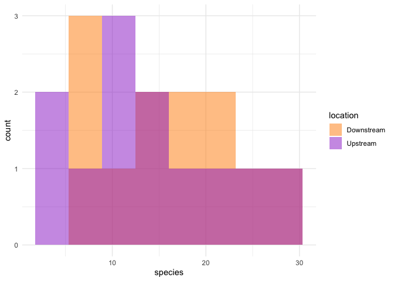
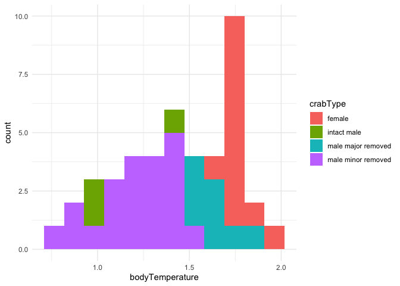

Lab 6 Comparing two means
================
brittney nelsen

``` r
# load packages -----------------------------------------------------------

library(tidyverse)
```

    ## ── Attaching packages ─────────────────────────────────────── tidyverse 1.3.0 ──

    ## ✓ ggplot2 3.3.3     ✓ purrr   0.3.4
    ## ✓ tibble  3.1.0     ✓ dplyr   1.0.2
    ## ✓ tidyr   1.1.2     ✓ stringr 1.4.0
    ## ✓ readr   1.4.0     ✓ forcats 0.5.0

    ## ── Conflicts ────────────────────────────────────────── tidyverse_conflicts() ──
    ## x dplyr::filter() masks stats::filter()
    ## x dplyr::lag()    masks stats::lag()

``` r
# read data ---------------------------------------------------------------

fish <- read_csv("chap12q19ElectricFish.csv")
```

    ## 
    ## ── Column specification ────────────────────────────────────────────────────────
    ## cols(
    ##   tributary = col_character(),
    ##   speciesUpstream = col_double(),
    ##   speciesDownstream = col_double()
    ## )

``` r
crabs <- read_csv("chap15q27FiddlerCrabFans.csv")
```

    ## 
    ## ── Column specification ────────────────────────────────────────────────────────
    ## cols(
    ##   crabType = col_character(),
    ##   bodyTemperature = col_double()
    ## )

Researchers studying the number of electric fish species living in
various parts of the Amazon basin were interested in whether the
presence of tributaries affected the local number of electric fish
species in the main rivers (Fernandes et al. 2004).

They counted the number of electric fish species above and below the
entrance point of a major tributary at 12 different river locations.

The data is provided in your GitHub repository.

For each question below, write a sentence answering the question and
show the code you used to come up with the answer, if applicable.

## Question A

> What is the mean different in the number of species between areas
> upstream and downstream of a tributary? What is the 95% confidence
> interval of this mean difference. Show your code and write a sentence
> giving your answer

The 95% confidence interval is -4.587031 to 8.253697. The mean
difference is 1.83334.

``` r
# data to tidy format -----------------------------------------------------

fish_long <- 
  pivot_longer(fish, speciesUpstream:speciesDownstream,
               names_to = "location",
               values_to = "species") %>% 
  mutate(location = str_remove(location, c("species"))) %>% 
  print()
```

    ## # A tibble: 24 x 3
    ##    tributary location   species
    ##    <chr>     <chr>        <dbl>
    ##  1 Içá       Upstream        14
    ##  2 Içá       Downstream      19
    ##  3 Jutaí     Upstream        11
    ##  4 Jutaí     Downstream      18
    ##  5 Japurá    Upstream         8
    ##  6 Japurá    Downstream       8
    ##  7 Coari     Upstream         5
    ##  8 Coari     Downstream       7
    ##  9 Purus     Upstream        10
    ## 10 Purus     Downstream      16
    ## # … with 14 more rows

``` r
# do stuff ----------------------------------------------------------------

ttest_results <- t.test(formula = species ~ location, data = fish_long)

ttest_results
```

    ## 
    ##  Welch Two Sample t-test
    ## 
    ## data:  species by location
    ## t = 0.59249, df = 21.81, p-value = 0.5596
    ## alternative hypothesis: true difference in means is not equal to 0
    ## 95 percent confidence interval:
    ##  -4.587031  8.253697
    ## sample estimates:
    ## mean in group Downstream   mean in group Upstream 
    ##                 16.41667                 14.58333

``` r
diff(ttest_results$estimate)
```

    ## mean in group Upstream 
    ##              -1.833333

## Question B

> Test the hypothesis that the tributaries have no effect on the number
> of species of electric fish.

The p-value is greater than 0.05, so we can conclude that the
tributaries have no effect.

``` r
t.test(formula = species ~ location, data = fish_long)
```

    ## 
    ##  Welch Two Sample t-test
    ## 
    ## data:  species by location
    ## t = 0.59249, df = 21.81, p-value = 0.5596
    ## alternative hypothesis: true difference in means is not equal to 0
    ## 95 percent confidence interval:
    ##  -4.587031  8.253697
    ## sample estimates:
    ## mean in group Downstream   mean in group Upstream 
    ##                 16.41667                 14.58333

## Question C

> State the assumptions that you had to make to complete parts (A) and
> (B). Create a graph to assess whether one of those assumptions was
> met.

I assumed that the measurements were taken from a random sample and that
the distribution of number of species is normal.

``` r
fish_long %>% 
  ggplot(aes(x = species)) +
  geom_histogram(
    aes(fill = location), 
    bins = 8, 
    alpha = 0.5, 
    position = "identity",
    na.rm = TRUE
  ) +
  scale_fill_manual(values = c("darkorange", "darkorchid", "cyan4")) +
  theme_minimal()
```

<!-- -->

``` r
  guides(color = "none")
```

    ## $colour
    ## [1] "none"
    ## 
    ## attr(,"class")
    ## [1] "guides"

\#\# ANOVA

Fiddler crabs are so called because males have a greatly enlarged
“major” claw, which is used to attract females and to defend a
burrow.

Darnell and Munguia (2011) recently suggested that this appendage might
also act as a heat sink, keeping males cooler while out of the burrow on
hot days.

To test this, they placed four groups of crabs into separate plastic
cups and supplied a source of radiant heat (60-watt light bulb) from
above. The four groups were intact male crabs, male crabs with the major
claw removed; male crabs with the other (minor) claw removed (control);
and intact female fiddler crabs.

They measured the body temperature of crabs every 10 minutes for 1.5
hours. These measurements were used to calculate a rate of heat gain for
every individual crab in degrees C/log minute. Rates of heat gain for
all crabs are provided in the accompanying data file.

## Question D

> Graph the distribution of body temperatures for each crab type:

``` r
crabs %>%
  ggplot(aes(x = bodyTemperature)) +
  geom_histogram(
    aes(fill = crabType),
    bins = 12,
    alpa = 0.5,
    position = "identity",
    na.rm = TRUE
  ) +
  theme_minimal()
```

    ## Warning: Ignoring unknown parameters: alpa

<!-- -->

## Question E

> Does body temperature varies among crab types? State the null and
> alternative hypothesis, conduct and ANOVA, and interpret the results.

null hypothesis: the mean body temperature is equal between the crab
types. alternative hypothesis: the mean body temperature is different
between one crab type.

We reject the null hypothesis and accept the alternative because there
was a statistical difference between mean body temperature and the
different crab types. F being greater than one and p-value being lower
than 0.05.

``` r
aov_crab_temp <-
  aov(bodyTemperature ~ crabType, data = crabs)

aov_crab_temp
```

    ## Call:
    ##    aov(formula = bodyTemperature ~ crabType, data = crabs)
    ## 
    ## Terms:
    ##                 crabType Residuals
    ## Sum of Squares  2.641310  3.467619
    ## Deg. of Freedom        3        80
    ## 
    ## Residual standard error: 0.2081952
    ## Estimated effects may be unbalanced
    ## 1 observation deleted due to missingness

``` r
summary(aov_crab_temp)
```

    ##             Df Sum Sq Mean Sq F value Pr(>F)    
    ## crabType     3  2.641  0.8804   20.31  7e-10 ***
    ## Residuals   80  3.468  0.0433                   
    ## ---
    ## Signif. codes:  0 '***' 0.001 '**' 0.01 '*' 0.05 '.' 0.1 ' ' 1
    ## 1 observation deleted due to missingness
